# React 设计模式

[书籍翻译地址(来自 SangKa)](https://github.com/SangKa/react-in-patterns-cn)

## 简介

本书的目标读者是对 React 是什么以及如何使用 React 有基础了解的开发者。本书并不是完整的 React 使用指南，而是对 React 流行的概念及设计模式的介绍。这些范式或多或少都是由开源社区所引入的，其主要目的在于引导你的抽象思维。例如，它讨论的不是 Flux，而是数据流。它讨论的不是高阶组件，而是组合( composition ) 。

本书的主观性比较强。它代表了我对所描述的模式的理解，可能和你在网络上看到的解释有所不同。当你使用本书作为论点与某人辩论时，请牢记这点。

还需要知道的是英语并非我的母语。如果你看到了错别字或不通顺的语句时，请前往 [github.com/krasimir/react-in-patterns](https://github.com/krasimir/react-in-patterns/tree/master/book) 帮忙改进。如果你阅读的是本书的打印版，可以使用笔随意写写 ¯\\_(ツ)_/¯ 。

## 组件通讯

每个 React 组件就像一个独立运行的小型系统。它有自己的状态、输入和输出。下面，我们将来探讨这些特性。

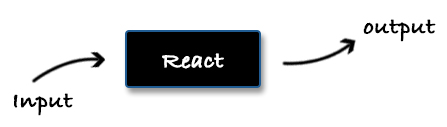

### 输入

React 组件的输入是它的 props 。它传递数据的方式如下所示:

```js
// Title.jsx
function Title(props) {
  return <h1>{props.text}</h1>;
}
Title.propTypes = {
  text: PropTypes.string
};
Title.defaultProps = {
  text: "Hello world"
};

// App.jsx
function App() {
  return <Title text="Hello React" />;
}
```

`Title` 组件只有一个输入属性 `text` 。父组件 (`App`) 在使用 `<Title>` 标签时提供此属性。在定义组件的同时我们还定义了 `propTypes` 。在 `propTypes` 中我们定义了每个属性的类型，这样的话，当某些属性的类型并非我们所预期时，React 会在控制台中进行提示。`defaultProps` 是另一个有用的选项。我们可以使用它来为组件的属性设置默认值，这样就算开发者忘记传入属性也能保障组件具有有效值。

React 并没有严格定义传入的属性应该是什么。它可以是任何我们想要传入的。例如，它可以是另外一个组件:

```js
function SomethingElse({ answer }) {
  return <div>The answer is {answer}</div>;
}
function Answer() {
  return <span>42</span>;
}

<SomethingElse answer={<Answer />} />;
```

还有一个 `props.children` 属性，它可以让我们访问父组件标签内的子元素。例如:

```js
function Title({ text, children }) {
  return (
    <h1>
      {text}
      {children}
    </h1>
  );
}
function App() {
  return (
    <Title text="Hello React">
      <span>community</span>
    </Title>
  );
}
```

在这个示例中，`App` 组件中的 `<span>community</span>` 就是 `Title` 组件中的 `children` 属性。注意，如果我们将 `{ children }` 从 `Title` 组件中移除，那么 `<span>` 标签将不会渲染。

16.3 版本之前，组件还有一种间接输入，叫做 `context` 。整个 React 组件树可能有一个 `context` 对象，组件树中的每个组件都可以访问它。想了解更多，请阅读 [依赖注入](#依赖注入) 章节。

### 输出

React 组件第一个明显的输出便是渲染出来的 HTML 。这是我们视觉上能看到的。但是，因为传入的属性可以是任何东西，包括函数，我们可以使用它来发送数据或触发操作。

在下面的示例中，我们有一个组件 `<NameField />`，它接受用户的输入并能将结果发送出去。

<span class="new-page"></span>

```js
function NameField({ valueUpdated }) {
  return <input onChange={event => valueUpdated(event.target.value)} />;
}
class App extends React.Component {
  constructor(props) {
    super(props);

    this.state = { name: "" };
  }
  render() {
    return (
      <div>
        <NameField valueUpdated={name => this.setState({ name })} />
        Name: {this.state.name}
      </div>
    );
  }
}
```

通常，我们需要逻辑的切入点。React 自带了十分方便的生命周期方法，它们可以用来触发操作。例如，在某个页面，我们需要获取外部的数据资源。

```js
class ResultsPage extends React.Component {
  componentDidMount() {
    this.props.getResults();
  }
  render() {
    if (this.props.results) {
      return <List results={this.props.results} />;
    } else {
      return <LoadingScreen />;
    }
  }
}
```

假设，我们要开发一个搜索结果的功能。我们已经有了一个搜索页面，我们在这里进行搜索。当点击提交按钮时，将跳转至 `/results` 页面，这里将显示搜索的结果。当我们进入结果显示页时，我们首先需要渲染加载页面，同时在 `componentDidMount` 生命周期钩子中触发请求结果数据的操作。当得到数据后，我们会将其传给 `<List>` 组件。

### 结语

我们可以将每个 React 组件想象成是一个黑盒，这种方式很不错。它有自己的输入、生命周期及输出。我们所需要做的只是将这些盒子组合起来。这或许就是 React 所提供的优势之一: 易于抽象，易于组合。

## 事件处理

对于事件处理，React 提供了一系列属性。解决方案几乎和使用标准化 DOM 完全一样。也有一些不同点，比如使用驼峰式或传入的是函数，但总体来说，还是十分相似的。

```js
const theLogoIsClicked = () => alert('Clicked');

<Logo onClick={ theLogoIsClicked } />
<input
  type='text'
  onChange={event => theInputIsChanged(event.target.value) } />
```

通常，我们在包含派发事件的元素的组件中处理事件。比如在下面的示例中，我们有一个事件处理函数，我们想要在同一个组件中运行函数或方法:

```js
class Switcher extends React.Component {
  render() {
    return <button onClick={this._handleButtonClick}>click me</button>;
  }
  _handleButtonClick() {
    console.log("Button is clicked");
  }
}
```

这样使用完全可以，因为 `_handleButtonClick` 是一个函数，而我们也确实将这个函数传给了 `onClick` 属性。问题是这段代码中并没有保持同一个上下文。所以，如果我们在 `_handleButtonClick` 函数中使用 `this` 来获取 `Switcher` 组件的引用时将会报错。

```js
class Switcher extends React.Component {
  constructor(props) {
    super(props);
    this.state = { name: "React in patterns" };
  }
  render() {
    return <button onClick={this._handleButtonClick}>click me</button>;
  }
  _handleButtonClick() {
    console.log(`Button is clicked inside ${this.state.name}`);
    // 导致
    // Uncaught TypeError: Cannot read property 'state' of null
  }
}
```

通常，我们使用 `bind` 来解决:

```js
<button onClick={this._handleButtonClick.bind(this)}>click me</button>
```

但是，这样做的话 `bind` 函数会一次又一次地被调用，这是因为 button 可能会渲染多次。一种更好的方式是在组件的构造函数中来创建绑定:

<span class="new-page"></span>

```js
class Switcher extends React.Component {
  constructor(props) {
    super(props);
    this.state = { name: "React in patterns" };
    this._buttonClick = this._handleButtonClick.bind(this);
  }
  render() {
    return <button onClick={this._buttonClick}>click me</button>;
  }
  _handleButtonClick() {
    console.log(`Button is clicked inside ${this.state.name}`);
  }
}
```

附带一提，在处理函数需要和组件的上下文保持统一时，Facebook [推荐](https://facebook.github.io/react/docs/reusable-components.html#no-autobinding) 的也是此技巧。

构造函数还是部分执行处理函数的好地方。例如，我们有一个表单，但是不想为每个 input 提供一个单独的处理函数。

<span class="new-page"></span>

```js
class Form extends React.Component {
  constructor(props) {
    super(props);
    this._onNameChanged = this._onFieldChange.bind(this, "name");
    this._onPasswordChanged = this._onFieldChange.bind(this, "password");
  }
  render() {
    return (
      <form>
        <input onChange={this._onNameChanged} />
        <input onChange={this._onPasswordChanged} />
      </form>
    );
  }
  _onFieldChange(field, event) {
    console.log(`${field} changed to ${event.target.value}`);
  }
}
```

### 结语

对于 React 中的事件处理，其实没有太多需要学习的。React 的作者们在保留开发者的使用习惯上做的十分出色。因为 JSX 使用的是类似 HTML 的语法，所以使用类似 DOM 的事件处理意义重大。

## 组合 ( composition )

React 最大的好处是它的可组合性。就我个人而言，我不知道还有哪个框架能提供这样如此简单地创建和组合组件的方式。本节我们将探讨一些好用的组合技巧，这些技巧都是经过实战验证的。

我们来看一个简单示例。假设我们的应用有一个头部，我们想在头部中放置导航。我们有三个 React 组件 —`App`、`Header` 和 `Navigation` 。这三个组件是一个嵌套一个的，所以我们得到的依赖关系如下:

```js
<App> -> <Header> -> <Navigation>
```

组合这些组件的简单方法是在需要它们的时候引用即可。

```js
// app.jsx
import Header from './Header.jsx';

export default function App() {
  return <Header />;
}

// Header.jsx
import Navigation from './Navigation.jsx';

export default function Header() {
  return <header><Navigation /></header>;
}

// Navigation.jsx
export default function Navigation() {
  return (<nav> ... </nav>);
}
```

但是，这种方式会引入一些问题:

- 我们可以把 `App` 看作是主要的组合场所。`Header` 可能还有其他元素，比如 logo、搜索框或标语。如果它们是以某种方式通过 `App` 组件传入的就好了，这样我们就无需创建目前这种硬编码的依赖关系。再比如说我们如果需要一个没有 `Navigation` 的 `Header` 组件该怎么办？我们无法轻松实现，因为我们将这两个组件紧绑在了一起。
- 代码很难测试。在 `Header` 中或许有一些业务逻辑，要测试它的话我们需要创建出一个组件实例。但是，因为它还导入了其他组件，所以我们还要为这些导入的组件创建实例，这样的话测试就变的很重。如果 `Navigation` 组件出了问题，那么 `Header` 组件的测试也将被破坏，这完全不是我们想要的效果。_(注意: [浅层渲染 ( shallow rendering )](https://facebook.github.io/react/docs/test-utils.html#shallow-rendering) 通过不渲染 `Header` 组件嵌套的子元素能在一定程度上解决此问题。)_

### 使用 React children API

React 提供了便利的 [`children`](https://facebook.github.io/react/docs/multiple-components.html#children) 属性。通过它父组件可以读取/访问它的嵌套子元素。此 API 可以使得 `Header` 组件不用知晓它的嵌套子元素，从而解放之前的依赖关系:

```js
export default function App() {
  return (
    <Header>
      <Navigation />
    </Header>
  );
}
export default function Header({ children }) {
  return <header>{ children }</header>;
};
```

注意，如果不在 `Header` 中使用 `{ children }` 的话，那么 `Navigation` 组件永远不会渲染。

现在 `Header` 组件的测试变得更简单了，因为完全可以使用空 `<div>` 来渲染 `Header` 组件。这会使用组件更独立，并让我们专注于应用的一小部分。

### 将 child 作为 prop 传入

每个 React 组件都接收属性。正如之前所提到的，关于传入的属性是什么并没有任何严格的规定。我们甚至可以传入其他组件。

```js
const Title = function() {
  return <h1>Hello there!</h1>;
};
const Header = function({ title, children }) {
  return (
    <header>
      {title}
      {children}
    </header>
  );
};
function App() {
  return (
    <Header title={<Title />}>
      <Navigation />
    </Header>
  );
}
```

当遇到像 `Header` 这样的组件时，这种技术非常有用，它们需要对其嵌套的子元素进行决策，但并不关心它们的实际情况。

### 高阶组件

很长一段时期内，高阶组件都是增强和组合 React 元素的最流行的方式。它们看上去与 [装饰器模式](http://robdodson.me/javascript-design-patterns-decorator/) 十分相似，因为它是对组件的包装与增强。

从技术角度来说，高阶组件通常是函数，它接收原始组件并返回原始组件的增强/填充版本。最简单的示例如下:

```js
var enhanceComponent = Component =>
  class Enhance extends React.Component {
    render() {
      return <Component {...this.props} />;
    }
  };

var OriginalTitle = () => <h1>Hello world</h1>;
var EnhancedTitle = enhanceComponent(OriginalTitle);

class App extends React.Component {
  render() {
    return <EnhancedTitle />;
  }
}
```

高阶组件要做的第一件事就是渲染原始组件。将高阶组件的 `props` 传给原始组件是一种最佳实践。这种方式将保持原始组件的输入。这便是这种模式的最大好处，因为我们控制了原始组件的输入，而输入可以包含原始组件通常无法访问的内容。假设我们有 `OriginalTitle` 所需要的配置:

```js
var config = require("path/to/configuration");

var enhanceComponent = Component =>
  class Enhance extends React.Component {
    render() {
      return <Component {...this.props} title={config.appTitle} />;
    }
  };

var OriginalTitle = ({ title }) => <h1>{title}</h1>;
var EnhancedTitle = enhanceComponent(OriginalTitle);
```

`appTitle` 是封装在高阶组件内部的。`OriginalTitle` 只知道它所接收的 `title` 属性，它完全不知道数据是来自配置文件的。这就是一个巨大的优势，因为它使得我们可以将组件的代码块进行隔离。它还有助于组件的测试，因为我们可以轻易地创建 mocks 。

这种模式的另外一个特点是为附加的逻辑提供了很好的缓冲区。例如，如果 `OriginalTitle` 需要的数据来自远程服务器。我们可以在高阶组件中请求此数据，然后将其作为属性传给 `OriginalTitle` 。

<span class="new-page"></span>

```js
var enhanceComponent = Component =>
  class Enhance extends React.Component {
    constructor(props) {
      super(props);

      this.state = { remoteTitle: null };
    }
    componentDidMount() {
      fetchRemoteData("path/to/endpoint").then(data => {
        this.setState({ remoteTitle: data.title });
      });
    }
    render() {
      return (
        <Component
          {...this.props}
          title={config.appTitle}
          remoteTitle={this.state.remoteTitle}
        />
      );
    }
  };

var OriginalTitle = ({ title, remoteTitle }) => (
  <h1>
    {title}
    {remoteTitle}
  </h1>
);
var EnhancedTitle = enhanceComponent(OriginalTitle);
```

这次，`OriginalTitle` 只知道它接收两个属性，然后将它们并排渲染出来。它只关心数据的表现，而无需关心数据的来源和方式。

- 关于高阶组件的创建问题，[Dan Abramov](https://github.com/gaearon) 提出了一个 [非常棒的观点](https://github.com/krasimir/react-in-patterns/issues/12)，像调用 `enhanceComponent` 这样的函数时，应该在组件定义的层级调用。换句话说，在另一个 React 组件中做这件事是有问题的，它会导致应用速度变慢并导致性能问题。 \*

<br /><br />

### 将函数作为 children 传入和 render prop

最近几个月来，React 社区开始转向一个有趣的方向。到目前为止，我们的示例中的 `children` 属性都是 React 组件。然而，有一种新的模式越来越受欢迎，`children` 属性是一个 JSX 表达式。我们先从传入一个简单对象开始。

```js
function UserName({ children }) {
  return (
    <div>
      <b>{children.lastName}</b>,{children.firstName}
    </div>
  );
}

function App() {
  const user = {
    firstName: "Krasimir",
    lastName: "Tsonev"
  };
  return <UserName>{user}</UserName>;
}
```

这看起来有点怪怪的，但实际上它确实非常强大。例如，当某些父组件所知道的内容不需要传给子组件时。下面的示例是待办事项的列表。`App` 组件拥有全部的数据，并且它知道如何确定待办事项是否完成。`TodoList` 组件只是简单地封装了所需的 HTML 标记。

<br /><br /><br /><br />

```js
function TodoList({ todos, children }) {
  return (
    <section className="main-section">
      <ul className="todo-list">
        {todos.map((todo, i) => (
          <li key={i}>{children(todo)}</li>
        ))}
      </ul>
    </section>
  );
}

function App() {
  const todos = [
    { label: "Write tests", status: "done" },
    { label: "Sent report", status: "progress" },
    { label: "Answer emails", status: "done" }
  ];
  const isCompleted = todo => todo.status === "done";
  return (
    <TodoList todos={todos}>
      {todo => (isCompleted(todo) ? <b>{todo.label}</b> : todo.label)}
    </TodoList>
  );
}
```

注意观察 `App` 组件是如何不暴露数据结构的。`TodoList` 完全不知道 `label` 和 `status` 属性。

除了使用 `render` 属性渲染待办事项而不是 `children` ，这种叫 _render prop_ 的模式和前面的模式几乎一样。

<br /><br /><br />

```js
function TodoList({ todos, render }) {
  return (
    <section className="main-section">
      <ul className="todo-list">
        {todos.map((todo, i) => (
          <li key={i}>{render(todo)}</li>
        ))}
      </ul>
    </section>
  );
}

return (
  <TodoList
    todos={todos}
    render={todo => (isCompleted(todo) ? <b>{todo.label}</b> : todo.label)}
  />
);
```

_将函数作为 children 传入_ 和 _render prop_ 是我最近非常喜欢的两个模式。当我们想要复用代码时，它们提供了灵活性和帮助。它们也是抽象代码的一种强有力的方式。

```js
class DataProvider extends React.Component {
  constructor(props) {
    super(props);

    this.state = { data: null };
    setTimeout(() => this.setState({ data: "Hey there!" }), 5000);
  }
  render() {
    if (this.state.data === null) return null;
    return <section>{this.props.render(this.state.data)}</section>;
  }
}
```

`DataProvider` 刚开始不渲染任何内容。5 秒后我们更新了组件的状态并渲染出一个 `<section>`，`<section>` 的内容是由 `render` 属性返回的。可以想象一下同样的组件，数据是从远程服务器获取的，我们只想数据获取后才进行显示。

```js
<DataProvider render={data => <p>The data is here!</p>} />
```

我们描述了我们想要做的事，而不是如何去做。细节都封装在了 `DataProvider` 中。最近，我们在工作中使用这种模式，我们必须将某些界面限制只对具有 `read:products` 权限的用户开放。我们使用的是 _render prop_ 模式。

```js
<Authorize
  permissionsInclude={["read:products"]}
  render={() => <ProductsList />}
/>
```

这种声明式的方式相当不错，不言自明。`Authorize` 会进行认证，以检查当前用户是否具有权限。如果用户具有读取产品列表的权限，那么我们便渲染 `ProductList` 。

### 结语

你是否对为何还在使用 HTML 感到奇怪？HTML 是在互联网创建之初创建的，直到现在我们仍然在使用它。原因在于它的高度可组合性。React 和它的 JSX 看起来像进化的 HTML ，因此它具备同样的功能。因此，请确保精通组合，因为它是 React 最大的好处之一。

## 受控输入和非受控输入

在 React 表单管理中有两个经常使用的术语: *受控输入*和*非受控输入*。*受控输入*是指输入值的来源是单一的。例如，下面的 `App` 组件有一个 `<input>` 字段，它就是*受控的*:

```js
class App extends React.Component {
  constructor(props) {
    super(props);
    this.state = { value: "hello" };
  }
  render() {
    return <input type="text" value={this.state.value} />;
  }
}
```

上面代码的结果是我们可以操作 input 元素，但是无法改变它的值。它永远都不会更新，因为我们使用的是单一数据源: `App` 组件的状态。要想让 input 正常工作的话，需要为其添加 `onChange` 处理方法来更新状态 (单一数据源)。`onChange` 会触发新的渲染周期，所以能看到在 input 中输入的文字。

<span class="new-page"></span>

```js
class App extends React.Component {
  constructor(props) {
    super(props);
    this.state = { value: "hello" };
    this._change = this._handleInputChange.bind(this);
  }
  render() {
    return (
      <input type="text" value={this.state.value} onChange={this._change} />
    );
  }
  _handleInputChange(e) {
    this.setState({ value: e.target.value });
  }
}
```

与之相反的是*非受控输入*，它让浏览器来处理用户的输入。我们还可以通过使用 `defaultValue` 属性来提供初始值，此后浏览器将负责保存输入的状态。

```js
class App extends React.Component {
  constructor(props) {
    super(props);
    this.state = { value: "hello" };
  }
  render() {
    return <input type="text" defaultValue={this.state.value} />;
  }
}
```

上面的 `<input>` 元素其实没什么用，因为我们的组件并不知道用户更新的值。我们需要使用 [`Refs`](https://reactjs.org/docs/glossary.html#refs) 来获取 DOM 元素的实际引用。

```js
class App extends React.Component {
  constructor(props) {
    super(props);
    this.state = { value: "hello" };
    this._change = this._handleInputChange.bind(this);
  }
  render() {
    return (
      <input
        type="text"
        defaultValue={this.state.value}
        onChange={this._change}
        ref={input => (this.input = input)}
      />
    );
  }
  _handleInputChange() {
    this.setState({ value: this.input.value });
  }
}
```

`ref` 属性接收字符串或回调函数。上面的代码使用回调函数来将 DOM 元素保存在*局部*变量 `input` 中。之后当 `onChange` 事件触发时，我们将 input 中的最新值保存到 `App` 组件的状态里。

_大量使用 `refs` 并非是个好主意。如果你的应用中出现了这种情况的话，那么你需要考虑使用受控输入并重新审视组件。_

### 结语

使用*受控输入*还是*非受控输入*，这个选择常常不被人所重视。但我相信这是一个最基本的决策，因为它决定了 React 组件的数据流。我个人认为*非受控输入*更像是一种反模式，应该尽量避免使用。

## 展示型组件和容器型组件

万事开头难。React 也不例外，作为初学者，我们也有一大堆问题。我应该将数据放在何处？如何进行变化通知？如何管理状态？这些问题的答案往往与上下文有关，而有时取决于 React 的实战经验。但是，有一种广泛使用的模式，有助于组织基于 React 的应用，那便是将组件分为展示型组件和容器型组件。

我们先从一个简单示例开始，首先说明此示例的问题，然后将组件分成容器型组件和展示型组件。示例中使用的是 `Clock` 组件，它接收 [Date](https://developer.mozilla.org/en-US/docs/Web/JavaScript/Reference/Global_Objects/Date) 对象作为属性并显示实时时间。

```js
class Clock extends React.Component {
  constructor(props) {
    super(props);
    this.state = { time: this.props.time };
    this._update = this._updateTime.bind(this);
  }
  render() {
    const time = this._formatTime(this.state.time);
    return (
      <h1>
        { time.hours } : { time.minutes } : { time.seconds }
      </h1>
    );
  }
  componentDidMount() {
    this._interval = setInterval(this._update, 1000);
  }
  componentWillUnmount() {
    clearInterval(this._interval);
  }
  _formatTime(time) {
    var [ hours, minutes, seconds ] = [
      time.getHours(),
      time.getMinutes(),
      time.getSeconds()
    ].map(num => num < 10 ? '0' + num : num);

    return { hours, minutes, seconds };
  }
  _updateTime() {
    this.setState({
      time: new Date(this.state.time.getTime() + 1000)
    });
  }
};

ReactDOM.render(<Clock time={ new Date() }/>, ...);
```

在组件的构造函数中，我们初始化了组件的状态，这里只保存了当前时间。通过使用 `setInterval` ，我们每秒更新一次状态，然后组件会重新渲染。要想看起来像个真正的时钟，我们还使用了两个辅助函数: `_formatTime` 和 `_updateTime` 。`_formatTime` 用来提取时分秒并确保它们是两位数的形式。`_updateTime` 用来将 `time` 对象设置为当前时间加一秒。

### 问题

这个组件中做了好几件事，它似乎承担了太多的职责。

- 它通过自身来修改状态。在组件中更改时间可能不是一个好主意，因为只有 `Clock` 组件知道当前时间。如果系统中的其他部分也需要此数据，那么将很难进行共享。
- `_formatTime` 实际上做了两件事，它从时间对象中提取出所需信息，并确保这些值永远以两位数字的形式进行展示。这没什么问题，但如果提取操作不是函数的一部分那就更好了，因为函数绑定了 `time` 对象的类型。即此函数既要知道数据结构，同时又要对数据进行可视化处理。

### 提取出容器型组件

容器型组件知道数据及其结构，以及数据的来源。它们知道是如何运转的，或所谓的*业务逻辑*。它们接收信息并对其进行处理，以方便展示型组件使用。通常，我们使用 [高阶组件](https://github.com/krasimir/react-in-patterns/tree/master/patterns/higher-order-components) 来创建容器型组件，因为它们为我们的自定义逻辑提供了缓冲区。

下面是 `ClockContainer` 的代码:

<span class="new-page"></span>

```js
// Clock/index.js
import Clock from "./Clock.jsx"; // <-- 展示型组件

export default class ClockContainer extends React.Component {
  constructor(props) {
    super(props);
    this.state = { time: props.time };
    this._update = this._updateTime.bind(this);
  }
  render() {
    return <Clock {...this._extract(this.state.time)} />;
  }
  componentDidMount() {
    this._interval = setInterval(this._update, 1000);
  }
  componentWillUnmount() {
    clearInterval(this._interval);
  }
  _extract(time) {
    return {
      hours: time.getHours(),
      minutes: time.getMinutes(),
      seconds: time.getSeconds()
    };
  }
  _updateTime() {
    this.setState({
      time: new Date(this.state.time.getTime() + 1000)
    });
  }
}
```

它接收 `time` (date 对象) 属性，使用 `setInterval` 循环并了解数据 (`getHours`、`getMinutes` 和 `getSeconds`) 的详情。最后渲染展示型组件并传入时分秒三个数字。这里没有任何展示相关的内容。只有*业务逻辑*。

### 展示型组件

展示型组件只涉及组件的外在展现形式。它们会有附加的 HTML 标记来使得页面更加漂亮。这种组件没有任何绑定及依赖。通常都是实现成 [无状态组件](https://facebook.github.io/react/blog/2015/10/07/react-v0.14.html#stateless-functional-components)，它们没有内部状态。

在本示例中，展示型组件只包含两位数的检查并返回 `<h1>` 标签:

```js
// Clock/Clock.jsx
export default function Clock(props) {
  var [hours, minutes, seconds] = [
    props.hours,
    props.minutes,
    props.seconds
  ].map(num => (num < 10 ? "0" + num : num));

  return (
    <h1>
      {hours} : {minutes} : {seconds}
    </h1>
  );
}
```

### 好处

将组件分成容器型组件和展示型组件可以增加组件的可复用性。不改变时间或不使用 JavaScript [Date](https://developer.mozilla.org/en-US/docs/Web/JavaScript/Reference/Global_Objects/Date) 对象的应用中，都可以使用 `Clock` 函数/组件。原因是它相当*单纯*，不需要对所需数据的详情有任何了解。

容器型组件封装了逻辑，它们可以搭配不同的展示型组件使用，因为它们不参与任何展示相关的工作。我们上面所采用的方法是一个很好的示例，它阐明了容器型组件是如何不关心展示部分的内容的。我们可以很容易地从数字时钟切换到模拟时钟，唯一的变化就是替换 `render` 方法中的 `<Clock>` 组件。

测试也将变得更容易，因为组件承担的职责更少。容器型组件不关心 UI 。展示型组件只是纯粹地负责展示，它可以很好地预测出渲染后的 HTML 标记。

### 结语

容器型和展示型的并非是新概念，但是它真的非常适合 React 。它使得应用具有更好的结构，易于管理和扩展。

## 单向数据流

单向数据流这种模式十分适合跟 React 搭配使用。它的主要思想是组件不会改变接收的数据。它们只会监听数据的变化，当数据发生变化时它们会使用接收到的新值，而不是去修改已有的值。当组件的更新机制触发后，它们只是使用新值进行重新渲染而已。

假设说有一个简单的 `Switcher` 组件，它包含一个按钮。当点击按钮时，我们需要在组件中使用一个标识来保存组件的开关状态。

```js
class Switcher extends React.Component {
  constructor(props) {
    super(props);
    this.state = { flag: false };
    this._onButtonClick = e =>
      this.setState({
        flag: !this.state.flag
      });
  }
  render() {
    return (
      <button onClick={this._onButtonClick}>
        {this.state.flag ? "lights on" : "lights off"}
      </button>
    );
  }
}

// ... 渲染组件
function App() {
  return <Switcher />;
}
```

此时，我们将数据保存在了组件内部。或者换句话说，知道 `flag` 存在的只有 `Switcher` 组件。我们来将 `flag` 提取到 store 中:

```js
var Store = {
  _flag: false,
  set: function(value) {
    this._flag = value;
  },
  get: function() {
    return this._flag;
  }
};

class Switcher extends React.Component {
  constructor(props) {
    super(props);
    this.state = { flag: false };
    this._onButtonClick = e => {
      this.setState({ flag: !this.state.flag }, () => {
        this.props.onChange(this.state.flag);
      });
    };
  }
  render() {
    return (
      <button onClick={this._onButtonClick}>
        {this.state.flag ? "lights on" : "lights off"}
      </button>
    );
  }
}

function App() {
  return <Switcher onChange={Store.set.bind(Store)} />;
}
```

`Store` 对象是一个 [单例](https://addyosmani.com/resources/essentialjsdesignpatterns/book/#singletonpatternjavascript)，它提供辅助函数 ( getter 和 setter ) 来读取/设置 `_flag` 属性。通过将 setter 传给 `Switcher` 组件，我们能够更新外部数据。目前我们应用的工作流程大致如下:

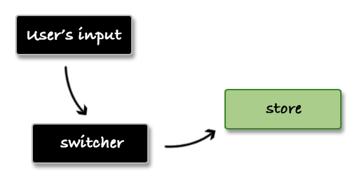

假设我们可以通过 `Store` 将 `flag` 值保存至服务端。当用户再使用时我们可以为其提供一个适当的初始值。如果用户上次离开时 `flag` 为 `true` ，那么我们应该显示 _"lights on"_，而不是默认值 _"lights off"_ 。现在变得有一些麻烦，因为数据存在于两个地方。UI 和 `Store` 中都有自身的状态。我们需要进行双向通讯，`Store` 到组件和组件到 `Store` 。

```js
// ... 在 App 组件中
<Switcher
  value={ Store.get() }
  onChange={ Store.set.bind(Store) } />

// ... 在 Switcher 组件中
constructor(props) {
  super(props);
  this.state = { flag: this.props.value };
  ...
```

工作流程改变后如下所示:

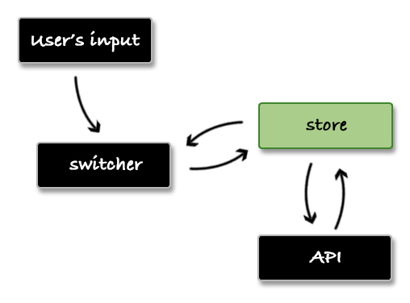

以上这些导致了需要在两处管理状态。如果 `Store` 可以再根据系统中的其他操作更改其值，将演变成怎样一种情况？我们必须将这种变化传播给 `Switcher` 组件，这样就会增加应用的复杂度。

单向数据流正是用来解决此类问题。它消除了在多个地方同时管理状态的情况，它只会在一个地方 (通常就是 store) 进行状态管理。要实现单向数据流的话，我们需要改造一下 `Store` 对象。我们需要允许我们订阅数据变化的逻辑：

<span class="new-page"></span>

```js
var Store = {
  _handlers: [],
  _flag: "",
  subscribe: function(handler) {
    this._handlers.push(handler);
  },
  set: function(value) {
    this._flag = value;
    this._handlers.forEach(handler => handler(value));
  },
  get: function() {
    return this._flag;
  }
};
```

然后我们将其与 `App` 组件联系起来，每次 `Store` 中的值产生变化时，都将重新渲染组件:

```js
class App extends React.Component {
  constructor(props) {
    super(props);

    this.state = { value: Store.get() };
    Store.subscribe(value => this.setState({ value }));
  }
  render() {
    return (
      <div>
        <Switcher value={this.state.value} onChange={Store.set.bind(Store)} />
      </div>
    );
  }
}
```

做出改变后，`Switcher` 将变得相当简单。我们不需要内部状态，所以组件可以使用无状态函数。

```js
function Switcher({ value, onChange }) {
  return (
    <button onClick={e => onChange(!value)}>
      {value ? "lights on" : "lights off"}
    </button>
  );
}

<Switcher value={Store.get()} onChange={Store.set.bind(Store)} />;
```

### 结语

这种模式的好处是组件只负责展示 store 的数据即可。而唯一的数据源将使得开发更加简单。如果只能从本书中掌握一个知识点的话，我会选这一章节。单向数据流彻底地改变了我设计功能时的思维方式，所以我相信对你也同样有效。

## Flux

我痴迷于将代码变得简单。注意，我说的不是代码量*更少*，而是*简单*。因为代码量更少并不一定意味着简单。我相信软件行业中大部分问题都源自不必要的复杂度。复杂度是我们进行抽象的结果。你也知道，我们 (程序员) 都喜欢进行抽象。我们喜欢将抽象的东西放入黑盒中，并希望这些黑盒能够在一起工作。

[Flux](http://facebook.github.io/flux/) 是一种构建用户界面的架构设计模式。它是由 Facebook 在它们的 [F8](https://youtu.be/nYkdrAPrdcw?t=568) 开发者大会上推出的。在此之后，许多公司都采纳了这个想法，这种模式用来构建前端应用似乎非常不错。Flux 通常和 [React](http://facebook.github.io/react/) 搭配使用。React 是 Facebook 发布的另外一个库。我个人在 [日常工作](http://antidote.me/) 中使用的是 React+Flux/Redux ，并且我敢说这种架构真的非常简单和灵活。该模式有助于更快地创建应用，同时使代码保持良好的组织结构。

### Flux 架构及其主要特点

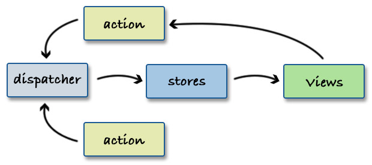

这种模式的主角是 _dispatcher_ 。它担当系统中所有事件的枢纽。它的工作就是接收我们称之为 _actions_ (动作) 的通知并将其传给所有的 _stores_ 。store 决定了是否对传入的动作感兴趣，如果感兴趣则通过改变自己的内部状态/数据来进行响应。改变会触发 _views_ (视图，这里指 React 组件) 的重新渲染。如果非要将 Flux 和大名鼎鼎的 MVC 相比较的话，Flux 中的 store 类似于 MVC 中的 model 。它负责保存和修改数据。

传给 dispatcher 的动作可以来自于视图，也可以来自于系统的其他部分，比如 services 。举个例子，一个执行 HTTP 请求的模块，当它接收到结果数据时，它可以触发动作以通知系统请求成功。

### 实现 Flux 架构

如其他流行的概念一样，Flux 也有一些 [变种](https://medium.com/social-tables-tech/we-compared-13-top-flux-implementations-you-won-t-believe-who-came-out-on-top-1063db32fe73) 。通常，要理解某种技术的最好途径就是去实现它。在下面的几节中，我们将创建一个库，它提供辅助函数来构建 Flux 模式。

#### Dispatcher

大多数场景下，我们只需要一个单个的 dispatcher 。因为它扮演胶水的角色，用来粘合其他部分，所以有一个就够了。dispatcher 需要知道两样东西: 动作和 stores 。动作只是简单地转发给 stores，所以没必要保存它们。然而，stores 应该在 dispatcher 中进行追踪，这样才可以遍历它们:

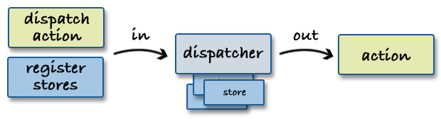

我开始是这样写的:

```js
var Dispatcher = function() {
  return {
    _stores: [],
    register: function(store) {
      this._stores.push({ store: store });
    },
    dispatch: function(action) {
      if (this._stores.length > 0) {
        this._stores.forEach(function(entry) {
          entry.store.update(action);
        });
      }
    }
  };
};
```

首先需要注意的是我们*期望*传入的 stores 上存在 `update` 方法。如果此方法不存在的话，抛出错误会更好些:

```js
register: function (store) {
  if (!store || !store.update) {
    throw new Error('You should provide a store that has an `update` method.');
  } else {
    this._stores.push({ store: store });
  }
}
```

<br />

#### 将视图和 stores 进行绑定

下一步是将视图与 stores 链接，这样当 stores 的状态发生改变时，我们才能进行重新渲染。

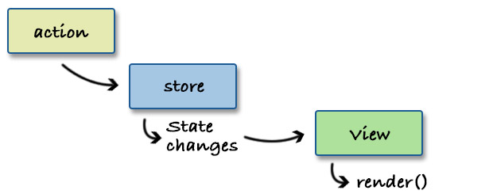

##### 使用辅助函数

一些 flux 的实现会自带辅助函数来完成此工作。例如:

```js
Framework.attachToStore(view, store);
```

然而，我并不怎么喜欢这种方式。要让 `attachToStore` 正常运行，需要视图和 store 中有一个特殊的 API ，因此我们需要严格定义这个新的公有方法。或者换句话说，Framework 对你说道: “你的视图和 store 应该具备这样的 API ，这样我才能能够将它们连接起来”。如果我们沿着这个方向前进的话，那么我们可能会定义可扩展的基类，这样我们就不会让 Flux 的细节去困扰开发人员。然后，Framework 又对你说到: “你所有的类都应该继承我们的类”。这听上去也并非好主意，因为开发人员可能会切换成另一个 Flux 提供者，这种切换势必会修改所有内容。

<br /><br />

##### 使用 mixin

那么如果使用 React 的 [mixins](https://facebook.github.io/react/docs/reusable-components.html#mixins) 呢？

```js
var View = React.createClass({
  mixins: [Framework.attachToStore(store)]
  ...
});
```

为已存在的 React 组件定义行为的话，这是一种“更好的”方式。所以，从理论上来说，我们可能会创建 mixin 来完成绑定工作。但说实话，我并认为这是个好主意。[看起来](https://medium.com/@dan_abramov/mixins-are-dead-long-live-higher-order-components-94a0d2f9e750) 不止我一个人有这种想法。我不喜欢 mixins 的原因是它们修改组件的方式是不可预见的。我完全不知道幕后发生了什么。所以我放弃这个选项。

##### 使用 context

解决此问题的另一项技术便是 React 的 [context](https://facebook.github.io/react/docs/context.html) 。使用 context 可以将 props 传递给子组件而无需在组件树中进行层层传递。Facebook 建议在数据必须到达嵌套层级非常深的组件的情况下使用 context 。

> 偶尔，你希望通过组件树传递数据，而不必在每个级别手动传递这些 props 。React 的 "context" 功能可以让你做到这一点。

我看到了与 mixins 的相似之处。context 是在组件树的顶层定义的，并魔法般的为组件树中的所有的子组件提供 props 。至于数据从而何来，尚不可知。

<br /><br /><br />

##### 高阶组件概念

高阶组件模式是由 Sebastian Markb&#229;ge 所[提出](https://gist.github.com/sebmarkbage/ef0bf1f338a7182b6775)的。它创建一个包装组件并返回原始的输入组件。使用高阶组件的话，就有机会来传递属性或应用附加逻辑。例如:

```js
function attachToStore(Component, store, consumer) {
  const Wrapper = React.createClass({
    getInitialState() {
      return consumer(this.props, store);
    },
    componentDidMount() {
      store.onChangeEvent(this._handleStoreChange);
    },
    componentWillUnmount() {
      store.offChangeEvent(this._handleStoreChange);
    },
    _handleStoreChange() {
      if (this.isMounted()) {
        this.setState(consumer(this.props, store));
      }
    },
    render() {
      return <Component {...this.props} {...this.state} />;
    }
  });
  return Wrapper;
}
```

`Component` 是我们想要附加到 `store` 中的视图。`consumer` 函数说明应该提取 store 的哪部分状态并发送给到视图。上面函数的简单用法如下所示:

```js
class MyView extends React.Component {
  ...
}

ProfilePage = connectToStores(MyView, store, (props, store) => ({
  data: store.get('key')
}));

```

这是个有趣的模式，因为它转移了职责。它是视图从 store 中拉取数据，而不是 store 将数据推送给视图。当然它也有自己的优势和劣势。优势在于它使得 store 变得简单。现在 store 只修改数据即可，并告诉大家: “嗨，我的状态发生改变了”。它不再负责将数据发送给别人。这种方法的缺点可能是我们将有不止一个组件 (包装组件) 参与其中。我们还需要视图、store 和 consumer 函数三者在同一个地方，这样我们才可以建立连接。

##### 我的选择

我的选择是最后一个选项 - 高阶组件，它已经非常接近于我想要的。我喜欢由视图来决定它所需要什么的这点。无论如何，*数据*都存在于组件中，所以将它保留在那里是有道理的。这也正是为什么生成高阶组件的函数通常与视图保持在同一个文件中的原因。如果我们使用类似的方法而压根不传入 store 呢？或者换句话说，函数只接收 consumer 。每当 store 发生变化时，都会调用此函数。

目前为止，我们的实现中只有 `register` 方法与 store 进行交互。

```js
register: function (store) {
  if (!store || !store.update) {
    throw new Error('You should provide a store that has an `update` method.');
  } else {
    this._stores.push({ store: store });
  }
}
```

通过使用 `register`，我们在 dispatcher 内部保存了 store 的引用。但是，`register` 不返回任何东西。或许，我们可以返回一个 **subscriber** (订阅者) 来接收 consumer 函数。

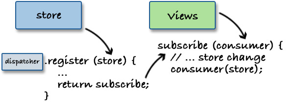

我决定将整个 store 发送给 consumer 函数，而不是 store 中的保存的数据。就像在高阶组件模式中一样，视图应该使用 store 的 getter 来说明它需要什么。这使得 store 变得相当简单并且不包含任何表现层相关的逻辑。

下面是更改后的 `register` 方法:

```js
register: function (store) {
  if (!store || !store.update) {
    throw new Error(
      'You should provide a store that has an `update` method.'
    );
  } else {
    var consumers = [];
    var subscribe = function (consumer) {
      consumers.push(consumer);
    };

    this._stores.push({ store: store });
    return subscribe;
  }
  return false;
}
```

最后要完成是 store 如何通知别人它内部的状态发生了改变。我们已经收集了 consumer 函数，但现在还没有任何代码来执行它们。

根据 flux 架构的基本原则，stores 改变自身状态以响应动作。在 `update` 方法中，我们发送了 `action`，但我们还应该发出 `change` 函数。调用此函数来触发 consumers :

```js
register: function (store) {
  if (!store || !store.update) {
    throw new Error(
      'You should provide a store that has an `update` method.'
    );
  } else {
    var consumers = [];
    var change = function () {
      consumers.forEach(function (consumer) {
        consumer(store);
      });
    };
    var subscribe = function (consumer) {
      consumers.push(consumer);
    };

    this._stores.push({ store: store, change: change });
    return subscribe;
  }
  return false;
},
dispatch: function (action) {
  if (this._stores.length > 0) {
    this._stores.forEach(function (entry) {
      entry.store.update(action, entry.change);
    });
  }
}
```

_注意如何在 `_stores` 数组中将 `change` 和 `store` 一起推送出去。稍后，在 `dispatch` 方法中通过传入 `action` 和 `change` 函数来调用 `update` _

常见用法是使用 store 的初始状态来渲染视图。在我们实现中，这意味着当库被使用时至少触发所有 consumer 函数一次。这可以在 `subscribe` 方法中轻松完成:

```js
var subscribe = function(consumer, noInit) {
  consumers.push(consumer);
  !noInit ? consumer(store) : null;
};
```

当然，有时候并不需要，所以我们添加了一个标识，它的默认值是假值。下面是 dispatcher 的最终版本:

<span class="new-page"></span>

```js
var Dispatcher = function() {
  return {
    _stores: [],
    register: function(store) {
      if (!store || !store.update) {
        throw new Error(
          "You should provide a store that has an `update` method"
        );
      } else {
        var consumers = [];
        var change = function() {
          consumers.forEach(function(consumer) {
            consumer(store);
          });
        };
        var subscribe = function(consumer, noInit) {
          consumers.push(consumer);
          !noInit ? consumer(store) : null;
        };

        this._stores.push({ store: store, change: change });
        return subscribe;
      }
      return false;
    },
    dispatch: function(action) {
      if (this._stores.length > 0) {
        this._stores.forEach(function(entry) {
          entry.store.update(action, entry.change);
        });
      }
    }
  };
};
```

<span class="new-page"></span>

### 动作 ( Actions )

你或许已经注意到了，我们还没讨论过动作。什么是动作？约定是它们应该是具有两个属性的简单对象: `type` 和 `payload` ：

```js
{
  type: 'USER_LOGIN_REQUEST',
  payload: {
    username: '...',
    password: '...'
  }
}
```

`type` 表明了这个动作具体是做什么的，`payload` 包含事件的相关信息，而且它并非是必需的。

有趣的是 `type` 从一开始就广为人知。我们知道什么类型的动作应该进入应用，谁来分发它们，已经 stores 对哪些动作感兴趣。因此，我们可以应用 [partial application](http://krasimirtsonev.com/blog/article/a-story-about-currying-bind) 并避免传入动作对象。例如:

```js
var createAction = function(type) {
  if (!type) {
    throw new Error("Please, provide action's type.");
  } else {
    return function(payload) {
      return dispatcher.dispatch({
        type: type,
        payload: payload
      });
    };
  }
};
```

`createAction` 具有以下优点:

- 我们不再需要记住动作的具体类型是什么。现在只需传入 payload 来调用此函数即可。
- 我们不再需要访问 dispatcher 了，这是个巨大的优势。否则，还需要考虑如何将它传递给每个需要分发动作的地方。
- 最后，我们不用再去处理对象，只是调用函数，这种方式要好得多。对象是*静态的*，而函数描述的是*过程*。

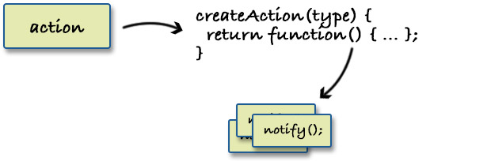

这种创建动作的方式非常流行，像上面这样的函数我们称之为 “action creators” 。

### 最终代码

在上一节中，在我们发出动作的同时隐藏了 dispatcher 。在 store 的注册过程中我们也可以这样做:

```js
var createSubscriber = function(store) {
  return dispatcher.register(store);
};
```

我们可以不暴露 dispaatcher，而只暴露 `createAction` 和 `createSubscriber` 这两个函数。下面是最终代码:

```js
var Dispatcher = function() {
  return {
    _stores: [],
    register: function(store) {
      if (!store || !store.update) {
        throw new Error(
          "You should provide a store that has an `update` method"
        );
      } else {
        var consumers = [];
        var change = function() {
          consumers.forEach(function(consumer) {
            consumer(store);
          });
        };
        var subscribe = function(consumer, noInit) {
          consumers.push(consumer);
          !noInit ? consumer(store) : null;
        };

        this._stores.push({ store: store, change: change });
        return subscribe;
      }
      return false;
    },
    dispatch: function(action) {
      if (this._stores.length > 0) {
        this._stores.forEach(function(entry) {
          entry.store.update(action, entry.change);
        });
      }
    }
  };
};

module.exports = {
  create: function() {
    var dispatcher = Dispatcher();

    return {
      createAction: function(type) {
        if (!type) {
          throw new Error("Please, provide action's type.");
        } else {
          return function(payload) {
            return dispatcher.dispatch({
              type: type,
              payload: payload
            });
          };
        }
      },
      createSubscriber: function(store) {
        return dispatcher.register(store);
      }
    };
  }
};
```

如果添加对 AMD、CommonJS 和全局引用的支持的话，那么最终的 JavaScript 文件共 66 行代码，文件大小为 1.7KB，压缩后 795 字节。

### 整合

我们写好的模块提供两个辅助函数来构建 Flux 项目。我们来写个简单的计数器应用，此应用不使用 React ，只为了解 Flux 模式的实际使用情况。

<span class="new-page"></span>

#### HTML

我们需要一些 UI 元素来进行互动:

```html
<div id="counter">
  <span></span> <button>increase</button> <button>decrease</button>
</div>
```

`span` 用来显示计数器的当前值。点击按钮会改变计数器的值。

#### 视图

```js
const View = function(subscribeToStore, increase, decrease) {
  var value = null;
  var el = document.querySelector("#counter");
  var display = el.querySelector("span");
  var [increaseBtn, decreaseBtn] = Array.from(el.querySelectorAll("button"));

  var render = () => (display.innerHTML = value);
  var updateState = store => (value = store.getValue());

  subscribeToStore([updateState, render]);

  increaseBtn.addEventListener("click", increase);
  decreaseBtn.addEventListener("click", decrease);
};
```

View 接收 store 的订阅者函数和增加/减少值的两个动作函数。View 中开始的几行代码只是用来获取 DOM 元素。

之后我们定义了 `render` 函数，它负责将值渲染到 `span` 标签中。当 store 发生变化时会调用 `updateState` 方法。我们将这两个函数传给 `subscribeToStore` 是因为我们想要视图更新以及进行初首次渲染。还记得 consumers 函数默认至少要调用一次吧？

最后要做的是为按钮绑定点击事件。

#### Store

每个动作都有类型。为这些类型创建常量是一种最佳实践，因为我们不想处理原始字符串。

```js
const INCREASE = "INCREASE";
const DECREASE = "DECREASE";
```

通常每个 store 只有一个实例。为了简单起见，我们将直接创建一个单例对象。

```js
const CounterStore = {
  _data: { value: 0 },
  getValue: function() {
    return this._data.value;
  },
  update: function(action, change) {
    if (action.type === INCREASE) {
      this._data.value += 1;
    } else if (action.type === DECREASE) {
      this._data.value -= 1;
    }
    change();
  }
};
```

`_data` 是 store 的内部状态。`update` 是 dispatcher 所调用的方法，我们在 `update` 中处理动作，并在完成时调用 `change()` 方法来通知发生了变化。`getValue` 是公共方法，视图会使用它来获取所需数据。(在这个案例中，就是计数器的值。)

#### 整合各个部分

这样，store 就完成了，它等待 dispatcher 发出的动作。视图我们也定义完了。现在来创建 store 的订阅者、动作并让这一切运转起来。

```js
const { createAction, createSubscriber } = Fluxiny.create();
const counterStoreSubscriber = createSubscriber(CounterStore);
const actions = {
  increase: createAction(INCREASE),
  decrease: createAction(DECREASE)
};

View(counterStoreSubscriber, actions.increase, actions.decrease);
```

这样就完成了。视图订阅 store 并进行渲染，因为我们的 consumers 实际上就是 `render` 方法。

#### 在线示例

这里有 JSBin 的 [在线示例](http://jsbin.com/koxidu/embed?js,output)。如果你觉得这个示例过于简单的话，请查阅 [Fluxiny 仓库中的示例](https://github.com/krasimir/fluxiny/tree/master/example)。它使用 React 作为视图层。

_在本章中所讨论的 Flux 实现可以在 [这里](https://github.com/krasimir/fluxiny) 找到。可以 [直接在浏览器中](https://github.com/krasimir/fluxiny/tree/master/lib) 使用，也可以通过 [npm 依赖](https://www.npmjs.com/package/fluxiny) 进行安装。_

## Redux

[Redux](https://redux.js.org/) 是一个库，它扮演着状态容器的角色，并负责管理应用的数据流。它是 [Dan Abramov](https://twitter.com/dan_abramov) 在 2015 年的 ReactEurope 开发者大会上推出的 ([视频](https://www.youtube.com/watch?v=xsSnOQynTHs))。它类似于 [Flux 架构](https://github.com/krasimir/react-in-patterns/blob/master/book/chapter-8/README.md#flux-architecture-and-its-main-characteristics) 并有很多共同点。在本章中，我们将使用 Redux 和 React 来创建一个小型的计数器应用。

<span class="new-page"></span>

### Redux 架构及其主要特点

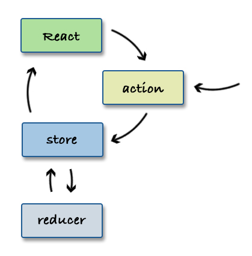

类似于 [Flux](https://github.com/krasimir/react-in-patterns/blob/master/book/chapter-8/README.md) 架构，由视图组件 (React) 来派发动作。同一个动作也可能是由系统的其他部分派发的，例如引导逻辑。动作不是派发到中心枢纽中，而是直接派发到 `store` 中。注意，我们说的是 `store`，而不是 `stores` ，这是因为在 Redux 中只有一个 store ，这是 Redux 与 Flux 的最重要的区别之一。决定数据如何改变的逻辑以纯函数 ( pure functions ) 的形式存在，我们称之为 `reducers` 。一旦 store 接收到动作，它会将当前状态和给定动作发送给 reducer 并要求其返回一个新的状态。然后，在数据不可变的方式下， reducer 需要返回新的状态。再然后， store 更新自身的内部状态。最后，与 store 连接的 React 组件会重新渲染。

概念相当清晰并再次遵循了 [单向数据流](https://github.com/krasimir/react-in-patterns/blob/master/book/chapter-7/README.md) 。我们来讨论每一个部分并引入一些支持 Redux 模式工作的新术语。

#### 动作 ( Actions )

Redux 中的动作和 Flux 一样，也只是有 `type` 属性的对象而已。该对象中的其他所有内容都被视为特定于上下文的数据，并且与模式无关，而与应用的逻辑相关。例如:

```js
const CHANGE_VISIBILITY = "CHANGE_VISIBILITY";
const action = {
  type: CHANGE_VISIBILITY,
  visible: false
};
```

使用像 `CHANGE_VISIBILITY` 这样的常量作为动作的类型是一种最佳实践。有很多支持 Redux 的工具和库，它们用来解决不用的问题，并且都只需要动作的类型即可。所以说，动作只是传递信息的一种便捷方式。

`visible` 属性是我们所提到过的元数据。它与 Redux 本身无关，它表示应用中某处需要使用的数据。

每次我们想要派发动作时都需要使用这样的对象。但是，一遍又一遍地写确实是让太人烦躁了。这也正是概念 _action creators_ 诞生的原因。action creator 是返回动作对象的函数，它可选项性地接收与动作相关联的属性。例如，如果将上面的 action 写成 action creator 会是这样:

```js
const changeVisibility = visible => ({
  type: CHANGE_VISIBILITY,
  visible
});

changeVisibility(false);
// { type: CHANGE_VISIBILITY, visible: false }
```

注意，我们将 `visible` 的值作为参数传入，这样我们不必去记住 (或导入) 动作的确切类型。使用这种辅助函数可以让代码更紧凑，更易于阅读。

#### Store

Redux 提供辅助函数 `createStore` 来创建 store 。它的函数签名如下:

```js
import { createStore } from 'redux';

createStore([reducer], [initial state], [enhancer]);
```

正如之前所提到的，reducer 是一个函数，它接收当前状态和动作，然后返回一个新的状态。第二个参数是 store 的初始状态。这是一种便捷的手段，可以用已有的数据来初始化我们的应用。这个功能是像服务器端渲染或持久体验这样的过程的本质。第三个参数 enhancer 提供 API 来使用第三方的中间件来扩展 Redux ，基本上是插入一些自身没有提供的功能，例如处理异步流程的工具。

创建好的 store 具有四个方法: `getState`、`dispatch`、`subscribe` 和 `replaceReducer` 。其中最重要的或许就是 `dispatch` :

```js
store.dispatch(changeVisibility(false));
```

这里我们使用的是 action creator 。我们将其结果 (即 action 对象) 传给 `dispatch` 方法。然后，它会传播给应用中的 reducers 。

在典型的 React 应用中，我们通常不会直接使用 `getState` 和 `subscribe` ，因为有辅助函数 (即将在后面的章节中讲到) 可以将组件和 store 联系起来并有效地订阅 store 的变化。作为订阅的一部分，我们自然可以收到当前的状态，所以不必自己去调用 `getState` 。`replaceReducer` 是一个高级 API ，它用来交互 store 所使用的当前 reducer 。我个人从来没使用过此方法。

#### Reducer

reducer 函数大概是 Redux 中最*精华*的部分。即使在此之前，我也喜欢编写纯函数来保持这种不可变的思想，但是 Redux 迫使我这样做。reducer 还有两个特点非常重要，没有它们的话基本上这种模式也不复存在。

(1) 它必须是纯函数 - 这意味着在输入不变的情况下，永远应该返回相同的结果。

(2) 它应该没有副作用 - 像访问全局变量、发起异步请求或等待 promise 解析这样的操作都不应该用在此处。

下面是个很简单的计数器 reducer :

```js
const counterReducer = function(state, action) {
  if (action.type === ADD) {
    return { value: state.value + 1 };
  } else if (action.type === SUBTRACT) {
    return { value: state.value - 1 };
  }
  return { value: 0 };
};
```

它没有任何副作用，每次都是返回一个全新的对象。我们根据之前的状态和传入的动作类型来累加出新的值。

#### 连接 React 组件

如果是在 React 上下文中讨论 Redux 的话，那基本离不开 [react-redux](https://github.com/reactjs/react-redux) 模块。它提供两样东西来进行 Redux 到组件的连接。

(1) `<Provider>` 组件 - 它是一个组件，它接收 store 并使得所有的子组件都可以通过 React 的 context API 来访问 store 。例如:

```js
<Provider store={myStore}>
  <MyApp />
</Provider>
```

通常，我们只在应用中的单个地方使用它。

(2) `connect` 函数 - 它是一个函数，它负责订阅 store 的更新和重新渲染组件。它是通过 [高阶组件](https://github.com/krasimir/react-in-patterns/blob/master/book/chapter-4/README.md#higher-order-component) 实现的。这是它的函数签名:

```
connect(
  [mapStateToProps],
  [mapDispatchToProps],
  [mergeProps],
  [options]
)
```

`mapStateToProps` 参数是一个函数，它接收 store 的当前状态，并且必须返回一组键值对 (对象)，这些对将作为 props 发送给我们的 React 组件。例如:

```js
const mapStateToProps = state => ({
  visible: state.visible
});
```

`mapDispatchToProps` 也是类似的，只是它接收的是 `dispatch` 函数，而不是 `state` 。这里是我们将派发动作定义成属性的地方。

```js
const mapDispatchToProps = dispatch => ({
  changeVisibility: value => dispatch(changeVisibility(value))
});
```

`mergeProps` 将 `mapStateToProps`、 `mapDispatchToProps` 和发送给组件的属性进行合并，它赋予我们机会去累加出更适合的属性。例如，如果我们需要触发两个动作，我们可以将它们组合成一个单独的属性并将其发送给 React 。`options` 接收一组如何控制连接的设置。

<br />

### 使用 Redux 的简单计数器应用

我们来使用上面所有的 API 来创建一个简单的计数器应用。

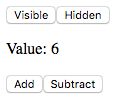

"Add" 和 "Subtract" 按钮只是改变 store 的值。"Visible" 和 "Hidden" 按钮用来控制计数器是否显示。

#### 创建动作

对我来说，每个 Redux 的开始都是对动作类型建模及定义我们所要保存的状态。在这个示例中，我们会有三个操作: 增加、减少和管理可见性。所有动作代码如下所示:

```js
const ADD = "ADD";
const SUBTRACT = "SUBTRACT";
const CHANGE_VISIBILITY = "CHANGE_VISIBILITY";

const add = () => ({ type: ADD });
const subtract = () => ({ type: SUBTRACT });
const changeVisibility = visible => ({
  type: CHANGE_VISIBILITY,
  visible
});
```

#### Store 及其 reducers

我们在解释 store 和 reudcers 时，有些技术点是没有讨论到的。通常，我们会有多个 reducer ，因为要管理多种状态。store 只有一个，所以理论上只有一个状态对象。但是大多数生产环境的应用的状态都是状态切片的组合。每个切片代表应用的一部分。这个小示例拥有计数和可见性两个切片。所以我们的初始状态应该是这样的:

```js
const initialState = {
  counter: {
    value: 0
  },
  visible: true
};
```

我们需要为这两部分分别定义 reducer 。这样会带来灵活性并提升代码的可读性。想象一下，如果我们有一个拥有十个或更多状态切片的巨型应用，并且我们只使用单个 reducer 函数来进行维护，这样管理起来将会非常困难。

Redux 提供辅助函数来让我们能够锁定 state 的某个特定部分并为其分配一个 reducer 。它就是 `combineReducers` :

```js
import { createStore, combineReducers } from 'redux';

const rootReducer = combineReducers({
  counter: function A() { ... },
  visible: function B() { ... }
});
const store = createStore(rootReducer);
```

函数 `A` 只接收 `counter` 切片作为状态，并且只返回切片这部分的状态。函数 `B` 也是同样的，它接收布尔值 (`visible` 的值) 并且必须返回布尔值。

`counter` 切片的 reducer 应该考虑到 `ADD` 和 `SUBTRACT` 两个动作，并基于动作来计算出新的 `counter` 状态。

```js
const counterReducer = function(state, action) {
  if (action.type === ADD) {
    return { value: state.value + 1 };
  } else if (action.type === SUBTRACT) {
    return { value: state.value - 1 };
  }
  return state || { value: 0 };
};
```

当 store 初始化时，每个 reducer 至少触发一次。最初运行的这一次，`state` 为 `undefined` ，`action` 为 `{ type: "@@redux/INIT"}` 。在这个实例中，reducer 应该返回数据的初始值 `{ value: 0 }` 。

`visible` 的 reducer 相当简单，它只处理动作 `CHANGE_VISIBILITY` :

```js
const visibilityReducer = function(state, action) {
  if (action.type === CHANGE_VISIBILITY) {
    return action.visible;
  }
  return true;
};
```

最后，我们需要将这两个 reducers 传给 `combineReducers` 来创建 `rootReducer` 。

```js
const rootReducer = combineReducers({
  counter: counterReducer,
  visible: visibilityReducer
});
```

#### 选择器 ( Selectors )

在开始 React 组件之前，我们先介绍一个 _选择器 ( selector )_ 的概念。在上一节中，我们知道状态通常都是细化成多个状态切片。我们有专门的 reducer 来负责更新数据，但是当涉及到获取状态数据时，我们仍然只是有一个对象。这里就是选择器派上用场的地方。选择器就是一个函数，它接收整个状态对象并提取出我们所需要的数据。例如，在这个小示例应用中我们需要两个数据:

```js
const getCounterValue = state => state.counter.value;
const getVisibility = state => state.visible;
```

这个计数器应用实在是太小了，完全体现不出选择器的威力。但是，在一个大项目中便截然不同。选择器的存在并不是为了少些几行代码，也不是为了可读性。选择器附带了这些内容，但它们也是上下文相关的，可能包含逻辑。由于它们可以访问整个状态，所以它们能够回答业务逻辑相关的问题。例如，“在 Y 页面用户是否有权限可以做 X 这件事”。这样的事通过一个选择器就可以完成。

#### React 组件

我们先来处理管理计数器可见性的 UI 部分。

```js
function Visibility({ changeVisibility }) {
  return (
    <div>
      <button onClick={() => changeVisibility(true)}>Visible</button>
      <button onClick={() => changeVisibility(false)}>Hidden</button>
    </div>
  );
}

const VisibilityConnected = connect(
  null,
  dispatch => ({
    changeVisibility: value => dispatch(changeVisibility(value))
  })
)(Visibility);
```

第二个组件略微有些复杂。将它命名为 `Counter` ，它渲染两个按钮和计数值。

```js
function Counter({ value, add, subtract }) {
  return (
    <div>
      <p>Value: {value}</p>
      <button onClick={add}>Add</button>
      <button onClick={subtract}>Subtract</button>
    </div>
  );
}

const CounterConnected = connect(
  state => ({
    value: getCounterValue(state)
  }),
  dispatch => ({
    add: () => dispatch(add()),
    subtract: () => dispatch(subtract())
  })
)(Counter);
```

这里 `mapStateToProps` 和 `mapDispatchToProps` 都需要，因为我们想读取 store 中的数据，同时还要派发动作。这个组件要接收三个属性: `value`、`add` 和 `subtract` 。

最后要完成的就是 `App` 组件，我们在这里进行应用的组装。

```js
function App({ visible }) {
  return (
    <div>
      <VisibilityConnected />
      {visible && <CounterConnected />}
    </div>
  );
}
const AppConnected = connect(state => ({
  visible: getVisibility(state)
}))(App);
```

我们再一次需要对组件进行 `connect` 操作，因为我们想要控制计数器的显示。`getVisibility` 选择器返回布尔值，它表示是否渲染 `CounterConnected` 组件。

### 结语

Redux 是一种很棒的模式。最近几年，JavaScript 社区将这种理念发扬下去，并使用一些新术语对其进行了增强。我认为一个典型的 Redux 应用应该是下面这样的:

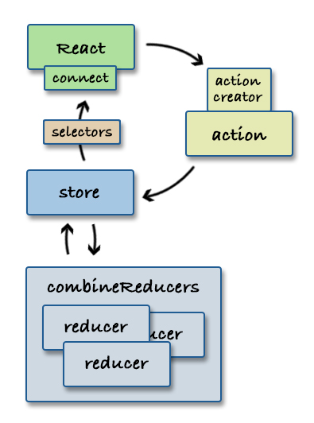

_顺便一提，我们还没有介绍过副作用管理。那将是另外的新篇章了，它有自己的理念和解决方案。_

我们可以得出结论，Redux 本身是一种非常简单的模式。它传授了非常有用的技术，但不幸的是光靠它自身往往是不够的。我们迟早要引入更多的概念或模式。当然这没有那么糟糕，我们只是先提起计划一下。

## 依赖注入

我们写的好多模块和组件都有依赖。能否管理这些依赖对于项目的成功至关重要。有一种叫做 [_依赖注入_](http://krasimirtsonev.com/blog/article/Dependency-injection-in-JavaScript) 的技术 (大多数人认为它是一种*模式*) 用来解决这种问题。

在 React 中，对依赖注入的需要是显而易见的。我们来考虑下面的应用的组件树:

```js
// Title.jsx
export default function Title(props) {
  return <h1>{ props.title }</h1>;
}

// Header.jsx
import Title from './Title.jsx';

export default function Header() {
  return (
    <header>
      <Title />
    </header>
  );
}

// App.jsx
import Header from './Header.jsx';

class App extends React.Component {
  constructor(props) {
    super(props);
    this.state = { title: 'React in patterns' };
  }
  render() {
    return <Header />;
  }
};
```

字符串 "React in patterns" 应该以某种方式到达 `Title` 组件。最直接的方式就从 `App` 传到 `Header` ，再从 `Header` 传到 `Title` 。但是，对于三层组件还好，但是如果嵌套的层级很深，并且需要传多个属性呢？大多数组件都扮演着代理的角色，将属性转发给子组件。

我们已经了解过 [高阶组件](#高阶组件) ，它可以用来注入数据。我们来使用同样的技术来注入 `title` 变量:

```js
// inject.jsx
const title = 'React in patterns';

export default function inject(Component) {
  return class Injector extends React.Component {
    render() {
      return (
        <Component
          {...this.props}
          title={ title }
        />
      )
    }
  };
}

// -----------------------------------
// Header.jsx
import inject from './inject.jsx';
import Title from './Title.jsx';

var EnhancedTitle = inject(Title);
export default function Header() {
  return (
    <header>
      <EnhancedTitle />
    </header>
  );
}
```

`title` 隐藏在了中间层 (高阶组件) ，在中间层我们将 `title` 属性传给了原始的 `Title` 组件。一切都很不错，但它只解决了一半问题。现在我们不再需要在组件树中将 `title` 向下层层传递，但是需要考虑数据如何到达 `inject.jsx` 辅助函数。

### 使用 React context (16.3 之前的版本)

_在 React 16.3 版本中，React 团队引入了新版的 context API ，如果你想使用新版 API ，那么可以跳过此节。_

React 有 [_context_](https://facebook.github.io/react/docs/context.html) 的概念。每个 React 组件都可以访问 _context_ 。它有些类似于 [事件总线](https://github.com/krasimir/EventBus) ，但是为数据而生。可以把它想象成在任意地方都可以访问的单一 _store_ 。

```js
// 定义 context 的地方
var context = { title: 'React in patterns' };

class App extends React.Component {
  getChildContext() {
    return context;
  }
  ...
};
App.childContextTypes = {
  title: React.PropTypes.string
};

// 使用 context 的地方
class Inject extends React.Component {
  render() {
    var title = this.context.title;
    ...
  }
}
Inject.contextTypes = {
  title: React.PropTypes.string
};
```

注意，我们需要使用 `childContextTypes` 和 `contextTypes` 来指定 context 对象的具体签名。如果不指定的话，那么 `context` 对象将为空。这点可能有点令人沮丧，因为我们可能会多写很多代码。所以将 `context` 写成允许我们储存和获取数据的服务，而不是一个普通对象是一种最佳实践。例如:

```js
// dependencies.js
export default {
  data: {},
  get(key) {
    return this.data[key];
  },
  register(key, value) {
    this.data[key] = value;
  }
};
```

然后，回到示例中，`App` 组件应该是这样的:

```js
import dependencies from "./dependencies";

dependencies.register("title", "React in patterns");

class App extends React.Component {
  getChildContext() {
    return dependencies;
  }
  render() {
    return <Header />;
  }
}
App.childContextTypes = {
  data: React.PropTypes.object,
  get: React.PropTypes.func,
  register: React.PropTypes.func
};
```

`Title` 组件通过 context 来获取数据:

```js
// Title.jsx
export default class Title extends React.Component {
  render() {
    return <h1>{this.context.get("title")}</h1>;
  }
}
Title.contextTypes = {
  data: React.PropTypes.object,
  get: React.PropTypes.func,
  register: React.PropTypes.func
};
```

理想情况下，我们不想每次需要访问 context`时都指定`contextTypes`。可以使用高阶组件来包装类型细节。但更好的做法是，我们可以编写一个更具描述性的工具函数，从而帮助我们声明确切的类型。例如，我们不再直接使用`this.context.get('title')` 来访问 context ，而是告诉高阶组件需要传递给组件的属性。例如:

```js
// Title.jsx
import wire from "./wire";

function Title(props) {
  return <h1>{props.title}</h1>;
}

export default wire(Title, ["title"], function resolve(title) {
  return { title };
});
```

`wire` 函数接收 React 组件、所需依赖 (依赖都已经注册过了) 的数组和我喜欢称之为 `mapper` 的转换函数。`mapper` 函数接收存储在 context 中的原始数据，并返回组件 ( `Title` ) 稍后使用的属性。在本例中，我们传入只是字符串，即 `title` 变量。但是，在真正的应用中，这个依赖项可以是大型的数据集合，配置对象或其他东西。

`wire` 函数的代码如下所示:

```js
export default function wire(Component, dependencies, mapper) {
  class Inject extends React.Component {
    render() {
      var resolved = dependencies.map(this.context.get.bind(this.context));
      var props = mapper(...resolved);

      return React.createElement(Component, props);
    }
  }
  Inject.contextTypes = {
    data: React.PropTypes.object,
    get: React.PropTypes.func,
    register: React.PropTypes.func
  };
  return Inject;
}
```

`Inject` 是高阶组件，它可以访问 context 并获取 `dependencies` 数组中的所有项。`mapper` 函数接收 `context` 数据并将其转换成我们组建所需要的属性。

### 使用 React context (16.3 及之后的版本)

这些年来，Fackbook 并不推荐使用 context API 。在官方文档中也有提到，此 API 不稳定，随时可能更改。确实也言中了。16.3 版本提供了一个新的 context API ，我认为新版 API 更自然，使用起来也更简单。

我们还是使用同一个示例，让字符串抵达 `<Title>` 组件。

我们先来定义包含 context 初始化的文件:

```js
// context.js
import { createContext } from "react";

const Context = createContext({});

export const Provider = Context.Provider;
export const Consumer = Context.Consumer;
```

`createContext` 返回的对象具有 `Provider` 和 `Consumer` 属性。它们实际上是有效的 React 类。`Provicer` 以 `value` 属性的形式接收 context 。`Consumer` 用来访问 context 并从中读取数据。因为它们通常存在于不同的文件中，所以单独创建一个文件来进行它们的初始化是个不错的主意。

假设说我们的 `App` 组件是根组件。在此我们需要传入 context 。

```js
import { Provider } from "./context";

const context = { title: "React In Patterns" };

class App extends React.Component {
  render() {
    return (
      <Provider value={context}>
        <Header />
      </Provider>
    );
  }
}
```

包装组件以及子组件现在共享同一个 context 。`<Title>` 组件是需要 `title` 字符串的组件之一，所以我们要在组件中使用 `<Consumer>` 。

```js
import { Consumer } from "./context";

function Title() {
  return <Consumer>{({ title }) => <h1>Title: {title}</h1>}</Consumer>;
}
```

_注意，`Consumer` 类使用函数作为嵌套子元素 ( render prop 模式) 来传递 context 。_

新的 API 让人感觉更容易理解，同时样板文件代码更少。此 API 仍然还很新，但看起来很有前途。它开启了一系列全新的可能性。

### 使用模块系统

如果不像使用 context 的话，还有一些其他方式来实现注入。它们并非 React 相关的，但是值得一提。方式之一就是使用模块系统。

众所周知，JavaScript 中的典型模块系统具有缓存机制。在 [Node 官方文档](https://nodejs.org/api/modules.html#modules_caching) 中可以看到:

> 模块在第一次加载后会被缓存。这也意味着（类似其他缓存机制）如果每次调用 require('foo') 都解析到同一文件，则返回相同的对象。

> 多次调用 require(foo) 不会导致模块的代码被执行多次。这是一个重要的特性。借助它, 可以返回“部分完成”的对象，从而允许加载依赖的依赖, 即使它们会导致循环依赖。

这对依赖注入有什么帮助吗？当然，如果我们导出一个对象，我们实际上导出的是一个 [单例]((https://addyosmani.com/resources/essentialjsdesignpatterns/book/#singletonpatternjavascript)，并且每个导入该文件的其他模块都将获得同一个对象。这使得我们可以 `register` 依赖，并稍后在另一个文件中 `fetch` 它们。

我们来创建一个新文件 `di.jsx` ，它的代码如下所示:

```js
var dependencies = {};

export function register(key, dependency) {
  dependencies[key] = dependency;
}

export function fetch(key) {
  if (dependencies[key]) return dependencies[key];
  throw new Error(`"${key} is not registered as dependency.`);
}

export function wire(Component, deps, mapper) {
  return class Injector extends React.Component {
    constructor(props) {
      super(props);
      this._resolvedDependencies = mapper(...deps.map(fetch));
    }
    render() {
      return (
        <Component
          {...this.state}
          {...this.props}
          {...this._resolvedDependencies}
        />
      );
    }
  };
}
```

我们将依赖保存在了 `dependencies` 这个全局变量中 (对于模块它是全局的，但对于整个应用来是并不是) 。然后，我们导出 `register` 和 `fetch` 这两个函数，它们负责读写依赖关系的数据。它看起来有点像对简单的 JavaScript 对象实现的 setter 和 getter 。再然后是 `wire` 函数，它接收 React 组件并返回 [高阶组件](#高阶组件) 。在组件的构造函数中，我们解析了依赖，并在稍后渲染原始组件时将其作为属性传给组件。我们按照相同的模式来描述我们需要的东西 (`deps` 参数)，并使用 `mapper` 函数来提取所需属性。

有了 `di.jsx` 辅助函数，我们又能够在应用的入口点 ( `app.jsx` ) 注册依赖，并且在任意组件 ( `Title.jsx` ) 中进行注入。

<span class="new-page"></span>

```js
// app.jsx
import Header from './Header.jsx';
import { register } from './di.jsx';

register('my-awesome-title', 'React in patterns');

class App extends React.Component {
  render() {
    return <Header />;
  }
};

// -----------------------------------
// Header.jsx
import Title from './Title.jsx';

export default function Header() {
  return (
    <header>
      <Title />
    </header>
  );
}

// -----------------------------------
// Title.jsx
import { wire } from './di.jsx';

var Title = function(props) {
  return <h1>{ props.title }</h1>;
};

export default wire(
  Title,
  ['my-awesome-title'],
  title => ({ title })
);
```

_如果查看 `Title.jsx` 文件的话，可以看到实际的组件和 `wire` 存在于不同的文件中。这种方式让组件和 mapper 函数的单元测试更简单。_

### 结语

依赖注入是一个大问题，尤其是在 JavaScript 中。许多人并没有意识到，但是，正确的依赖管理是每个开发周期中的关键过程。JavaScript 生态提供了不同的工具，作为开发者的我们应该挑选最适合自己的工具。

## 组件样式

React 是视图层。因此，它可以控制在浏览器中渲染的标记。众所周知，页面上的 HTML 标记与 CSS 的样式是紧密联系在一起的。有几种方式来处理 React 应用的样式，在本章中我们将一一介绍这些最流行的方式。

### 经典 CSS 类

JSX 语法相当接近于 HTML 语法。因此，我们拥有与 HTML 几乎相同的标签属性，我们仍然可以使用 CSS 类来处理样式。类是定义在外部的 `.css` 文件中的。唯一需要注意的是 React 中使用的是 `className` ，而不是 `class` 。例如:

```html
<h1 className="title">Styling</h1>
```

### 内联样式

内联样式也能很好的工作。类似于 HTML ，我们可以通过 `style` 属性来直接传入样式。但是，`style` 属性在 HTML 中是字符串，而在 JSX 中必须得是一个对象。

```js
const inlineStyles = {
  color: "red",
  fontSize: "10px",
  marginTop: "2em",
  "border-top": "solid 1px #000"
};

<h2 style={inlineStyles}>Inline styling</h2>;
```

因为我们用 JavaScript 编写样式，所以从语法角度来看，是有一些限制的。如果我们想要使用原始的 CSS 属性名称，那么我们需要用引号包裹起来，否则需要遵循驼峰式命名规则。但是，使用 JavaScript 编写样式却非常有趣，它比普通的 CSS 更具灵活性。例如样式的继承:

```js
const theme = {
  fontFamily: "Georgia",
  color: "blue"
};
const paragraphText = {
  ...theme,
  fontSize: "20px"
};
```

`theme` 中有一些基础样式，然后在 `paragraphText` 中混入 `theme` 的样式。简而言之，我们能够使用 JavaScript 的全部能力来组织 CSS 。重要的是最终生成了一个传给 `style` 属性的对象。

### CSS 模块

[CSS 模块](https://github.com/css-modules/css-modules/blob/master/docs/get-started.md) 是建立在我们到目前为止所介绍过的内容之上的。如果你不喜欢 JavaScript 用法来写 CSS ，那么可以使用 CSS 模块，它可以让我们继续编写普通的 CSS 。通常，这个库是在打包阶段发挥作用的。可以将它作为编译步骤的一部分进行连接，但通常作为构建系统插件分发。

下面的示例可以让你快速对其运行原理有个大致的了解:

<br /><br />

```js
/* style.css */
.title {
  color: green;
}

// App.jsx
import styles from "./style.css";

function App() {
  return <h1 style={ styles.title }>Hello world</h1>;
}
```

默认情况下是无法这样使用的，只有使用了 CSS 模块，我们才能直接导入普通的 CSS 文件并使用其中的类。

当我们提到 _普通的 CSS_ ，并非真的指最原始的 CSS 。它支持一些非常有用的组合技巧。例如:

```
.title {
  composes: mainColor from "./brand-colors.css";
}
```

### Styled-components

[Styled-components](https://www.styled-components.com/) 则是另一种完全不同的方向。此库不再为 React 组件提供内联样式。我们需要使用组件来表示它的外观感受。例如，我们创建了 `Link` 组件，它具有特定的风格和用法，而再使用 `<a>` 标签。

```js
const Link = styled.a`
  text-decoration: none;
  padding: 4px;
  border: solid 1px #999;
  color: black;
`;

<Link href="http://google.com">Google</Link>;
```

还有一种扩展类的机制。我们还可以使用 `Link` 组件，但是会改变它的文字颜色，像这样:

```js
const AnotherLink = styled(Link)`
  color: blue;
`;

<AnotherLink href="http://facebook.com">Facebook</AnotherLink>;
```

对我而言，到目前为止 styled-components 可能是多种处理 React 样式的方法中我最感兴趣的。用它来创建组件非常简单，并可以忘记样式本身的存在。如果你的公司有能力创建一个设计系统并用它构建产品的话，那么这个选项可能是最合适的。

### 结语

处理 React 应用的样式有多种方式。我个人在生产环境中试验过所有方式，可以说无所谓对与错。正如 JavaScript 中大多数技术一样，你需要挑选一个更适合你的方式。

## 集成第三方库

React 或许是构建 UI 的最佳选择之一。良好的设计与强大的支持，还有庞大的社区。但是，有些情况下，我们想要使用外部服务或想要集成一些完全不同的东西。众所周知，React 在底层与实际 DOM 有大量的交互并控制页面上渲染什么，基本上它是开发者与实际 DOM 间的桥梁。这也正是为什么 React 集成第三方组件有些麻烦的地方。在本节中，我们将来介绍如何安全地混用 React 和 jQuery 的 UI 插件。

### 示例

我为这个示例挑选了 [_tag-it_](https://github.com/aehlke/tag-it) 这个 jQuery 插件。它将无序列表转换成可以管理标签的输入框：

```html
<ul>
  <li>JavaScript</li>
  <li>CSS</li>
</ul>
```

转换成:


要运行起来，我们需要引入 jQueyr、jQuery UI 和 _tag-it_ 插件。这是运行的代码:

```jsx
$("<dom element selector>").tagit();
```

选择 DOM 元素，然后调用 `tagit()` 。

现在，我们来创建一个简单的 React 应用，它将使用 jQuery 插件:

```jsx
// Tags.jsx
class Tags extends React.Component {
  render() {
    return (
      <ul>
        {this.props.tags.map((tag, i) => (
          <li key={i}>{tag} </li>
        ))}
      </ul>
    );
  }
}

// App.jsx
class App extends React.Component {
  constructor(props) {
    super(props);

    this.state = { tags: ["JavaScript", "CSS"] };
  }
  render() {
    return (
      <div>
        <Tags tags={this.state.tags} />
      </div>
    );
  }
}

ReactDOM.render(<App />, document.querySelector("#container"));
```

`App` 类是入口。它使用了 `Tags` 组件，`Tags` 组件会根据传入的 `tags` 属性来展示无序列表。当 React 在页面上渲染列表时就有了 `<ul>` 标签，这样就可以和 jQuery 插件连接起来。

### 强制单通道渲染

首先，我们要做的就是强制 `Tags` 组件进行单通道渲染。这是因为当 React 在实际 DOM 中添加完容器元素后，我们想将控制权交给 jQuery 。如果不做控制的话，那么 React 和 jQuery 将会操纵同一个 DOM 元素而彼此之间不知情。要实现单通道渲染，我们需要使用生命周期方法 `shouldComponentUpdate`，像这样:

```jsx
class Tags extends React.Component {
  shouldComponentUpdate() {
    return false;
  }
  ...
```

这里永远都返回 `false` ，我们想让组件知道永远不进行重新渲染。定义 `shouldComponentUpdate` 对于 React 组件来说，是让其知道是否触发 `render` 方法。这适用于我们的场景，因为我们想使用 React 来添加 HTML 标记，添加完后就不想再依靠 React 。

### 初始化插件

React 提供了 [API](https://facebook.github.io/react/docs/refs-and-the-dom.html) 来访问实际 DOM 节点。我们需要在相应的节点上使用 `ref` 属性，稍后可以通过 `this.refs` 来访问 DOM 。`componentDidMount` 是最适合初始化 _tag-it_ 插件的生命周期方法。这是因为当 React 将 `render` 方法返回的结果挂载到 DOM 时才调用此方法。

<br /><br /><br />

```jsx
class Tags extends React.Component {
  ...
  componentDidMount() {
    this.list = $(this.refs.list);
    this.list.tagit();
  }
  render() {
    return (
      <ul ref='list'>
      {
        this.props.tags.map(
          (tag, i) => <li key={ i }>{ tag } </li>
        )
      }
      </ul>
    );
  }
  ...
```

上面的代码和 `shouldComponentUpdate` 一起使用就会使 React 渲染出有两项的 `<ul>` ，然后 _tag-it_ 会其转换成标签可编辑的插件。

### 使用 React 控制插件

假如说我们想要通过代码来为已经运行的 _tag-it_ 插件添加新标签。这种操作将由 React 组件触发，并需要使用 jQuery API 。我们需要找到一种方式将数据传递给 `Tags` 组件，但同时还要保持单通道渲染。

为了说明整个过程，我们需要在 `App` 类中添加一个输入框和按钮，点击按钮时将输入框的值传给 `Tags` 组件。

<br />

```jsx
class App extends React.Component {
  constructor(props) {
    super(props);

    this._addNewTag = this._addNewTag.bind(this);
    this.state = {
      tags: ["JavaScript", "CSS"],
      newTag: null
    };
  }
  _addNewTag() {
    this.setState({ newTag: this.refs.field.value });
  }
  render() {
    return (
      <div>
        <p>Add new tag:</p>
        <div>
          <input type="text" ref="field" />
          <button onClick={this._addNewTag}>Add</button>
        </div>
        <Tags tags={this.state.tags} newTag={this.state.newTag} />
      </div>
    );
  }
}
```

我们使用内部状态来存储新添加的标签名称。每次点击按钮时，我就更新状态并触发 `Tags` 组件的重新渲染。但由于 `shouldComponentUpdate` 的存在，页面上不会有任何的更新。唯一的变化就是得到 `newTag` 属性的新值，另一个生命周期方法 `componentWillReceiveProps` 会捕获到属性的新值:

<br /><br /><br />

```jsx
class Tags extends React.Component {
  ...
  componentWillReceiveProps(newProps) {
    this.list.tagit('createTag', newProps.newTag);
  }
  ...
```

`.tagit('createTag', newProps.newTag)` 是纯粹的 jQuery 代码。如果想调用第三方库的方法，`componentWillReceiveProps` 是个不错的选择。

下面是 `Tags` 组件的完整代码:

```jsx
class Tags extends React.Component {
  componentDidMount() {
    this.list = $(this.refs.list);
    this.list.tagit();
  }
  shouldComponentUpdate() {
    return false;
  }
  componentWillReceiveProps(newProps) {
    this.list.tagit("createTag", newProps.newTag);
  }
  render() {
    return (
      <ul ref="list">
        {this.props.tags.map((tag, i) => (
          <li key={i}>{tag} </li>
        ))}
      </ul>
    );
  }
}
```

<br />

### 结语

尽管 React 承担了操纵 DOM 树的工作，但我们仍可以集成第三方的库和服务。生命周期方法让我们在渲染过程中可以进行足够的控制，这样才能够完美地连接 React 和非 React 世界。

## 总结

React 已然成为最流行的 UI 构建库。它自带的 API 很棒，简单而强大。麻烦的部分是构建复杂应用的话， React 本身往往并不足够。有些概念我们必须要知道，才能做出正确的选择。由社区所提出的这些设计模式在大规模应用中运行良好。这本书以些许固执己见的方式介绍了这些模式中的大部分。希望你能喜欢 :)
